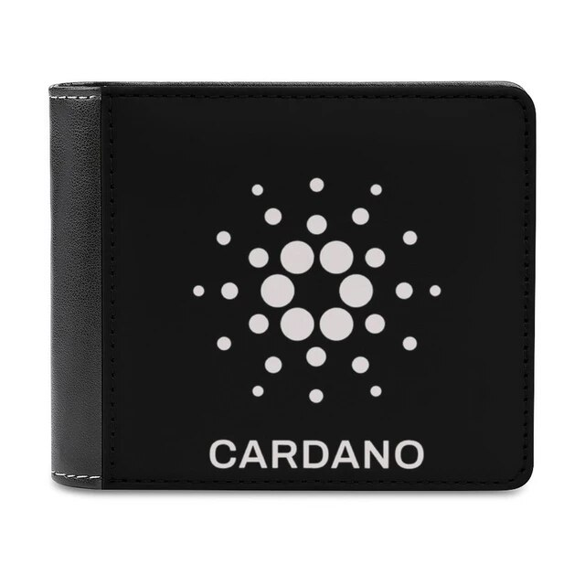
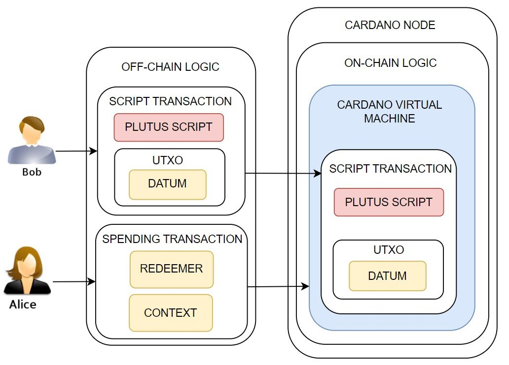

# Các khái niệm cơ bản trong Cardano cần biết trước khi viết hợp đồng thông minh (Tiếp theo)

## 1. Địa chỉ

Đầu tiên, đến với địa chỉ, các bạn có thể hình dung rằng địa chỉ trong
Blockchain giống như một chiếc ví của các bạn, nhưng thay vì nhận tiền thì nó sẽ
dùng để lưu trữ các UTxO có thể chứa tiền hoặc 1 loại tài sản nào đó ví dụ như
token hay NFT và một số dữ liệu khác khi đính kèm giao dịch.

Mỗi địa chỉ được cấu thành từ 2 hoặc 3 thành phần gồm: Header, Payment
Credentials và Stake credentials (Có thể tùy chọn chỉ có một trong hai)

- **Header:** Phần này mô tả loại địa chỉ (vd như cá nhân hay đa chữ ký) và mạng
  mà địa chỉ đó được sử dụng, nó cũng bao gồm một mã phân biệt mạng để tránh
  trường hợp nhập lẫn giữa các mạng với nhau (Mạng testnet và mạng mainnet).
- **Payment Credentials:** Có thể hiểu đơn giản đây là phần mô tả các điều kiện để
  chi tiêu tải sản từ địa chỉ, nó chứa Verification Key ở dạng hash của một
  script kiểm soát logic chi tiêu.
- **Stake credentials:** Phần này các bạn có thể kiểm soát cách stake liên kết với
  địa chỉ được sử dụng để bầu chọn cho các nhà sản xuất khối. Nó cũng có thể
  chứa khóa Verification Key ở dạng hash hoặc hash của một script kiểm soát
  logic ủy quyền.

### Có hai hình thức ở phần chi tiêu như sau

- Verification Key ở dạng hash: Sử dụng chữ ký kỹ thuật số từ khóa riêng tương
  ứng với khóa xác minh để chứng minh quyền sở hữu.

- Script: Cho phép xác định logic chi tiêu phức tạp hơn, chẳng hạn như yêu cầu
  chữ ký từ nhiều người hoặc thực hiện các tính toán dựa trên dữ liệu trong giao
  dịch.

### Phần ủy quyền và mục đích sử dụng script

Phần ủy quyền cho phép bạn ủy quyền stake của mình cho các nhóm stake được gọi
là stake pool. Script cũng có thể được sử dụng cho các mục đích khác ngoài chi
tiêu, như phát hành tài sản do người dùng định nghĩa (NFT, token) hoặc rút phần
thưởng stake.

## 2. Script

Được viết bằng một số ngôn ngữ như Plutus, Aiken, Marlowe, … Và được biên dịch
thành mã Untyped Plutus Core (UPLC) sau đó được biên dịch tiếp ra mã CBOR để
giao tiếp với lõi Cardano, đảm bảo tuyệt đối an toàn và chuyên dụng. Script nhận
các transaction, datum và redeemer làm đầu vào, và đầu ra sẽ trả về True nếu
giao dịch thỏa mãn được script được viết ra là hợp lệ, và sẽ trả về false nếu
làm ngược lại, và đây chính là hợp đồng thông minh mà các bạn sắp được biết đến.

### a. Datum:

Datum các bạn có thể hiểu đơn giản nó là dự liệu được gắn vào output khi nó được
tạo ra, nhằm cung cấp tham số cho script để thực hiện các tính toán và kiểm tra
điều kiện hay các ràng buộc có trên hợp đồng(script), có thể ví dụ như chữ ký
người bán, thời gian, lượng tiền được thể hiện bằng kiểu dữ liệu int, …

### b. Redeemer:

Đây chính là dữ liệu được cung cấp cùng với giao dịch để hoàn thành việc xác
thực script, nhưng cũng có thể dùng để cung cấp các giá trị đầu vào bổ sung cho
script, ví dụ như chữ ký, token, bằng chứng, …

### c. Điểm khác biệt

Datum là dữ liệu tùy chỉnh gắn với UTxO, cung cấp thông tin cho script xử lý.
Giống như các biến đầu vào trong hàm. Redeemer là dữ liệu do người dùng cung cấp
khi chi tiêu UTxO, giống như tham số đầu vào của hàm. Script sử dụng cả datum và
redeemer để đưa ra quyết định có chấp nhận giao dịch hay không.

#### Ví dụ

Hãy tưởng tượng bạn bán một chiếc xe và nhận UTxO chứa tiền thanh toán. UTxO có
script yêu cầu chữ ký của bạn và người mua đồng ý chuyển nhượng quyền sở hữu xe.

Khi hoàn tất thủ tục pháp lý, người mua cung cấp chữ ký (redeemer) cho script.
Script kiểm tra chữ ký và datum (thông tin nhà), nếu hợp lệ thì UTxO được chi
tiêu và tiền được chuyển cho bạn.

Hãy cùng nhau học và phát triển kỹ năng lập trình của bạn!

Chúc các bạn thành công và không ngừng nâng cao trình độ của mình!
