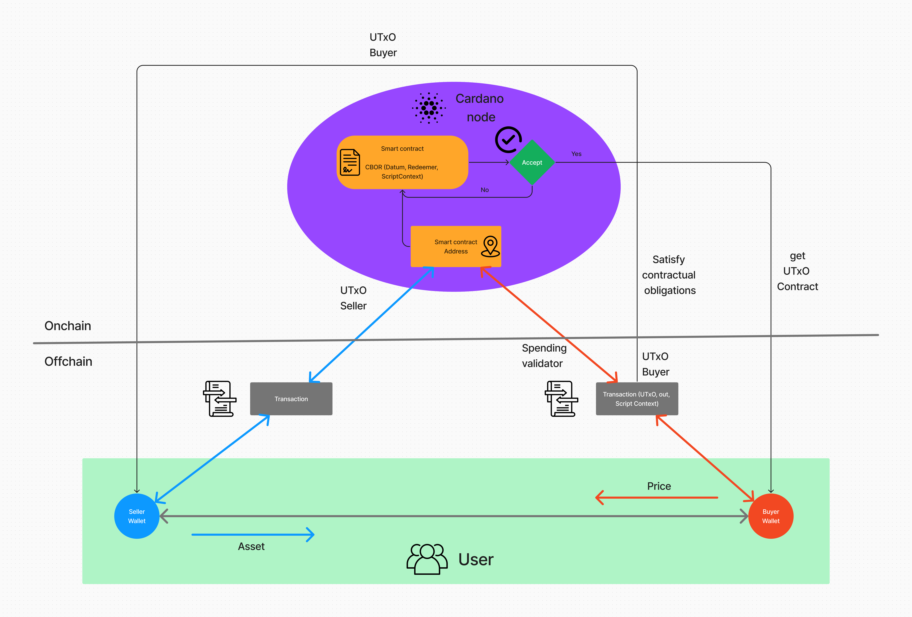

# Hợp đồng thông minh sàn giao dịch NFT

Xin chào các bạn. Qua các bài học của các chương trước, mình nghĩ cũng đã đến lúc các bạn nên tạo một project thực tế. Hôm nay mình sẽ hướng dẫn các bạn viết một hợp đồng thông minh về sàn giao dịch NFT cơ bản bao gồm các chức năng sell, buy và refund NFT.

Do đây cũng là một bài khá nâng cao nên nếu các bạn muốn hiểu tường tận nhất bài học này, các bạn hãy đảm bảo rằng các bạn đã nắm vững các kiến thức ở các bài học trước.

Chúng ta cùng bắt đầu bài học nhé:

## Bài toán
Các bạn có bao giờ tự hỏi rằng cần làm gì để ứng dụng bao quát các kiến thức mà các bạn đã học chưa?

Mình nghĩ rằng việc xây dựng NFT sẽ giúp các bạn nắm vững kỹ năng lập trình smart contract của các bạn và sẽ giúp các bạn có một cái nhìn sâu rộng hơn về cách hoạt động của hệ sinh thái Cardano. Vì vậy, hôm nay mình sẽ hướng dẫn các bạn xây dựng hợp đồng thông minh của bài toán này.


Câu hỏi đặt ra là vậy chúng ta sẽ làm những gì trong sàn giao dịch này?

Nó sẽ bao gồm các chức năng: buy, sell và refund NFT. Mình sẽ mô tả cụ thể cho các bạn:



Hình ảnh các bạn vừa thấy ở trên chính là hình ảnh kiến trúc của bài toán này. Mình sẽ giải thích qua một số thành phần như sau:

* **Mạng Offchain:** Đây là phần ngoài của hệ thống Blockchain Cardano, nơi người mua và người bán tạo và quản lý các giao dịch của họ.

* **Bán sản phẩm:** Ở phần mạng Offchain, người bán sẽ tạo một giao dịch chứa thông tin về tài sản họ muốn bán, chẳng hạn như giá và định danh tài sản, sau đó giao dịch sẽ được gửi lên hợp đồng thông minh trên mạng Onchain.

* **Kiểm tra giao dịch:** Trước khi gửi giao dịch lên hợp đồng thông minh của sàn giao dịch trên mạng Onchain, hệ thống sẽ kiểm tra xem người bán có đủ tài sản để bán không. Nếu có, giao dịch này sẽ tiến lên bước tiếp theo, ngược lại, nó sẽ bị từ chối.

* **Mạng Onchain:** Chính là hệ thống mạng lưới Blockchain, nơi này sẽ xử lý mọi vấn đề như: Xử lý giao dịch, hợp đồng thông minh, ghi nhận lịch sử giao dịch và mọi hoạt động liên quan đến Blockchain.

* **Lưu trữ tài sản:** Sau khi giao dịch của người bán được xác nhận, tài sản sẽ được lưu trữ trong địa chỉ của hợp đồng thông minh. Tài sản này sẽ bị khóa lại với các điều khoản trong hợp đồng cho đến khi có người muốn mua.

* **Mua sản phẩm:** Khi người mua muốn mua sản phẩm, họ sẽ tạo một giao dịch yêu cầu mở khóa hợp đồng và chuyển tiền thanh toán cho người bán. Hợp đồng sẽ chỉ mở khóa nếu người mua thỏa mãn tất cả các yêu cầu trong hợp đồng, chẳng hạn như trả đúng giá, gửi tiền đúng địa chỉ của người bán, và trả tiền bản quyền cho tác giả.

* **Hoàn tất giao dịch:** Nếu người mua đáp ứng đủ các điều kiện, giao dịch sẽ được thực hiện. Tài sản của người bán sẽ được chuyển đến ví của người mua và tiền thanh toán của người mua sẽ được chuyển đến ví của người bán và tác giả. Các đầu ra đã được thiết lập trước trên giao dịch của người mua sẽ được kích hoạt, và giao dịch này sẽ được lưu trữ trong lịch sử của Blockchain.

* **Xử lý thất bại:** Nếu giao dịch không đáp ứng các điều kiện, nó sẽ bị từ chối và các đầu ra sẽ không được thực thi, tức là tiền vẫn sẽ ở trong ví người mua mà không chuyển đi đâu.

* **Lấy lại tài sản:** Trong trường hợp người bán muốn lấy lại tài sản của họ, họ sẽ phải đáp ứng các điều kiện trong hợp đồng, chẳng hạn như xác minh chữ ký của họ và trả phí sàn.

Đó là tổng quan của bài toán này, các bạn có thể xem thêm [whitepaper](https://www.canva.com/design/DAFyF5hoeUc/0nLdQ7KVkAqKdKKMf3rtYg/edit) của sàn giao dịch hoàn chỉnh của chúng mình.

## Khởi tạo project sàn giao dịch NFT

Chắc hẳn các bạn vẫn còn nhớ cú pháp khởi tạo project mà các bạn đã từng được làm từ chương 1 đến chương 4. Ở đây chúng ta sẽ khởi tạo project có tên c5.

```sh
aiken new tutorial/c5
```

Nó sẽ tạo ra môt tập cấu trúc thư mục như sau:

```sh
./c5
│
├── README.md
├── aiken.toml
├── lib
│   └── c5
└── validators
```

Sau khi khởi tạo xong, các bạn hãy chạy thêm lệnh:

```sh
aiken check
```

Lúc này, chúng ta đã hoàn tất khởi tạo project Aiken, mọi thứ bây giờ chúng ta cần làm là viết smart contract.

## Khởi tạo module chứa các kiểu tự định nghĩa

Ở trong thư mục **lib/c5** của project, các bạn khởi tạo thêm giúp mình một file tên là _**types.ak**_. Module này sẽ chứa tất cả các kiểu mà chúng ta sẽ định nghĩa trong hợp đồng này.

### Khai báo thư viện

Ở module này mình cần định nghĩa **VerificationKeyHash**, bản chất là hash từ hàm băm **Blake2b_224** nên mình cần phải khai báo nó.

```rust
use aiken/hash.{ Blake2b_224, Hash }
use aiken/transaction/credential.{ VerificationKey }
```

### Định nghĩa VerificationKeyHash

Sau khi có các thành phần trên, mình sẽ định nghĩa kiểu dữ liệu **VerificationKeyHash** và để nó ở dạng kiểu dữ liệu public, vì vậy bạn hãy thêm từ khoá **pub** vào trước **type**.

```rust
pub type VerificationKeyHash = Hash<Blake2b_224, VerificationKey>
```

### Module hoàn chỉnh

```rust
use aiken/hash.{ Blake2b_224, Hash }
use aiken/transaction/credential.{ VerificationKey }

pub type VerificationKeyHash = Hash<Blake2b_224, VerificationKey>
```

## Khởi tạo module chứa các hằng số

Trong thư mục **lib/c5**, các bạn khởi tạo giúp mình một file nữa có tên _**constants.ak**_. Module này chứa tất cả các hàm số có trong bản hợp đồng này.

### Khai báo các thư viện

Trong module này, mình có xây dựng một cấu trúc địa chỉ ví gồm 2 thành phần: **payment_credential** và **stake_credential**. Mình cần khai báo kiểu của 2 thành phần này và kiểu **VerificationKeyHash** mình đã định nghĩa ở phía trên.

```rust
// Declare the libraries to use
use aiken/transaction/credential
    .{ Address
    ,  Inline
    ,  VerificationKeyCredential }
use contract/types
    .{ VerificationKeyHash }

```

### Khởi tạo và xây dựng địa chỉ sàn giao dịch

Trước khi muốn xây dựng một địa chỉ ví hoàn chỉnh, ta cần 2 trường là payment verificationKeyHash và stake verificationKeyHash.

```rust
// Payment address of the exchange
pub const demarket_payment_vkh: VerificationKeyHash =
  #"3a4e6757f24d9dddb65c8aef60d0999957b3650453e5e7721fb4fd42"

// Staking address of the exchange
pub const demarket_stake_vkh: VerificationKeyHash =
  #"32798960f1b4dc35be90add0d31aed0e3019ea0e47288296a5737e60"

// Combine the above 2 addresses into the trading exchange address
pub fn demarket_addr() -> Address {
  Address {
    payment_credential: VerificationKeyCredential(demarket_payment_vkh),
    stake_credential: Some(
      Inline(VerificationKeyCredential(demarket_stake_vkh)),
    ),
  }
}
```

### Khởi tạo tham số pct

Đây là một tham số tính % mức phí sàn mà seller cần phải trả cho sàn, ở bài học này mình sẽ để mức phí sàn là **1%**.

```rust
// Transaction fee percentage
pub const demarket_pct: Int = 1
```

### Module hoàn chỉnh

```rust
// Declare the libraries to use
use aiken/transaction/credential
    .{ Address
    ,  Inline
    ,  VerificationKeyCredential }
use contract/types
    .{ VerificationKeyHash }

// Payment address of the exchange
pub const demarket_payment_vkh: VerificationKeyHash =
  #"3a4e6757f24d9dddb65c8aef60d0999957b3650453e5e7721fb4fd42"

// Staking address of the exchange
pub const demarket_stake_vkh: VerificationKeyHash =
  #"32798960f1b4dc35be90add0d31aed0e3019ea0e47288296a5737e60"

// Combine the above 2 addresses into the trading exchange address
pub fn demarket_addr() -> Address {
  Address {
    payment_credential: VerificationKeyCredential(demarket_payment_vkh),
    stake_credential: Some(
      Inline(VerificationKeyCredential(demarket_stake_vkh)),
    ),
  }
}

// Transaction fee percentage
pub const demarket_pct: Int = 1
```

## Khởi tạo module chứa các phương thức cần dùng

Trong thư mục **lib/c5**, các bạn khởi tạo giúp mình một file nữa có tên _**utils.ak**_. Module này chứa tất cả các hàm số có trong bản hợp đồng này.

### Khai báo thư viện

Một số thư viện cần dùng để viết các phương thức mình sẽ khai báo chúng ở đây.

```rust
// Declare the libraries to use
use aiken/transaction/credential.{ Address }
use aiken/list
use aiken/transaction.{ Transaction, Output }
use aiken/transaction/value.{ lovelace_of }
use c5/types.{ VerificationKeyHash }
```

### Phương thức tính số tiền

Đây là một phương thức check giá tiền, cụ thể nó sẽ lấy giá tiền từ output của giao dịch tiêu thụ và so sánh với giá của tài sản có trên datum, số tiền có trong đầu ra phải lớn hơn hoặc bằng mức giá trong datum thì phương thức này sẽ trả về true, ngược lại nó sẽ trả về false.

```rust
// The function checks the amount
pub fn check_amount(output: Output, price: Int) -> Bool {

  // With the amount in the output being greater than the amount passed in from the parameter
  lovelace_of(output.value) >= price
}
```

### Phương thức kiểm tra địa chỉ người nhận

Phương thức này sẽ nhận vào một output và một địa chỉ của người nhận có cấu trúc đầy đủ. Nếu trong output có chứa địa chỉ nhận vào trong phương thức bằng cách kiểm tra payment_credential có trong 2 địa chỉ với nhau. Nếu trung khớp thì nó sẽ trả về true, ngược lại nó sẽ trả về false.

```rust
// Function to check address
pub fn check_address(output: Output, address: Address) -> Bool {
  
  // Check the two payment addresses from the address in the output and the address passed in from the parameter
  output.address.payment_credential == address.payment_credential
}
```

### Phương thức kiểm tra chữ ký

Phương thức này sẽ kiểm tra chữ ký trong datum có trong ScriptContext hay không, nếu như có, hàm sẽ trả về true, ngược lại sẽ trả về false. Phương thức này sẽ dùng cho refund tài sản, vì nếu đúng chữ ký của seller, smart contract mới refund tài sản về ví cho seller.

```rust
// The function checks the signature contained in the transaction
pub fn must_be_signed_by(transaction: Transaction, vk: VerificationKeyHash) {

  // Check whether the signature in the input parameter is in the transaction signature list or not
  list.has(transaction.extra_signatories, vk)
}
```

### Phương thức kiểm tra số lượng đầu ra giao dịch

Phương thức này đơn giản chỉ kiểm tra xem đủ 3 đầu ra giao dịch hay không, nếu một trong 3 cái có giá trị None, hàm sẽ trả về false, ngược lại, hàm sẽ trả về true.

```rust
// The function checks whether the output exists or not
pub fn check_none(output_seller: Option<Output>, output_author: Option<Output>, output_demarket: Option<Output>) -> Bool {
  
  // If one of the 3 outputs does not exist, the function will return False
  if output_seller == None || output_author == None || output_demarket == None{

    False
  }else{

    // Otherwise, the function will return True
    True
  }
}
```

### Phương thức tìm đầu ra của giao dịch

Phương thức này sẽ tìm kiếm các đầu ra trong một giao dịch với 2 điều kiện thoả mãn đó chính là:

* Giá của đầu ra đó phải lớn hơn giá có trên datum của tài sản đó.

* Địa chỉ người nhận có trong output phải trùng khớp với địa chỉ người nhận có trong datum.

```rust
// Search and return output that satisfies the amount in the output must be greater than the amount in the input parameter and the payment address in the output address must be the same as the payment address in the address from the parameter transmisson in
pub fn find_output(outputs: List<Output>, price: Int, address: Address) -> Option<Output>{
  list.find(outputs, 
    fn(output) {
      check_amount(output, price) &&
      check_address(output, address)
    }
  )
}
```

### Module hoàn chỉnh

```rust
// Declare the libraries to use
use aiken/transaction/credential
    .{ Address }
use aiken/list
use aiken/transaction
    .{ Transaction
    ,  Output }
use aiken/transaction/value
    .{ lovelace_of }
use contract/types
    .{ VerificationKeyHash }

// The function checks the amount
pub fn check_amount(output: Output, price: Int) -> Bool {

  // With the amount in the output being greater than the amount passed in from the parameter
  lovelace_of(output.value) >= price
}

// Function to check address
pub fn check_address(output: Output, address: Address) -> Bool {
  
  // Check the two payment addresses from the address in the output and the address passed in from the parameter
  output.address.payment_credential == address.payment_credential
}

// The function checks the signature contained in the transaction
pub fn must_be_signed_by(transaction: Transaction, vk: VerificationKeyHash) {

  // Check whether the signature in the input parameter is in the transaction signature list or not
  list.has(transaction.extra_signatories, vk)
}

// The function checks whether the output exists or not
pub fn check_none(output_seller: Option<Output>, output_author: Option<Output>, output_demarket: Option<Output>) -> Bool {
  
  // If one of the 3 outputs does not exist, the function will return False
  if output_seller == None || output_author == None || output_demarket == None{
    False

  }else{

    // Otherwise, the function will return True
    True
  }
}

// Search and return output that satisfies the amount in the output must be greater than the amount in the input parameter and the payment address in the output address must be the same as the payment address in the address from the parameter transmisson in
pub fn find_output(outputs: List<Output>, price: Int, address: Address) -> Option<Output>{
  list.find(outputs, 
    fn(output) {
      check_amount(output, price) &&
      check_address(output, address)
    }
  )
}
```

## Hoàn thiện hợp đồng thông minh

Đến đây, chúng ta sẽ bắt đầu viết hợp đồng thông minh cho sàn giao dịch này.

Đầu tiên, trong thư mục _**validators**_, các bạn hãy tạo cho mình một file có tên trùng khớp với tên project bạn đã khởi tạo, ở đây mình sẽ tạo một file có tên là c5.ak.

### Khai báo các thư viện

Ở đây mình sẽ khai báo các kiểu, hàm có sẵn trong ngôn ngữ lập trình này và các module mình đã viết ở phía trên

```rust
// Declare the libraries needed in the contract
// There are a number of libraries we have written ourselves and imported into the contract file
use aiken/transaction/credential
    .{ from_verification_key }
use aiken/list
    .{ filter
    ,  length }
use aiken/transaction
    .{ Transaction
    ,  ScriptContext
    ,  Spend }
use aiken/transaction/value
    .{ PolicyId
    ,  AssetName }
use contract/utils
    .{ must_be_signed_by
    ,  check_none
    ,  find_output
    ,  check_address
    ,  check_amount }
use contract/types
    .{ VerificationKeyHash }
use contract/constants
    .{ demarket_addr
    ,  demarket_pct }
```

### Khai báo Datum

Ở trong bài toán này, mình sẽ khai báo kiểu datum bao gồm các trường:

* **policyId:** Là policyID của NFT của tài sản này.
* **assetName:** Tương tư, đây là tên của NFT này.
* **seller:** Trong này có chứa VerificationKeyHash của seller, dùng để kiểm tra điều kiện về địa chỉ người nhận.
* **author:** Tương tự như seller. trường này chứa VerificationKeyHash của author.
* **price:** Đây là trường giá niêm yết của NFT mà người bán đặt.
* **royalties:** Đây cũng là một trường giá, đó là % tiền bản quyền dành cho tác giả.

### Viết logic hợp đồng thông minh

Đầu tiên, các bạn hãy khởi tạo một validator, bên trong có chứa hàm có tên trùng khớp với tên project, hàm này sẽ nhận vào 3 tham số: datum, redeemer và scriptcontext nhưng với hợp đồng này mình không dùng redeemer nên mình sẽ để kiểu void hoặc các bạn có thể xoá nó đi cũng được.

```rust
validator{
    // This contract function receives data and information from the transaction (ScriptContext)
    fn c5(datum: Datum, _redeemer: Void, ctx: ScriptContext) {
        ...
    }
}
```

Trong phương thức c5, mình sẽ lấy ra lần lượt các tham số như transaction, purpose, ...

```rust
// Get transaction and purpose from ctx
let ScriptContext {transaction, purpose} = ctx

// Retrieve the outputs contained in the transaction
let Transaction {outputs, ..} = transaction
```

Mình sẽ kiểm tra xem chữ ký trong giao dịch có trùng khớp với chữ ký của người bán hay không.

```rust
// Check to see if the signature in the newly created transaction matches the signature the seller posted to the previous contract
let seller_sign = must_be_signed_by(transaction, datum.seller)
```

Mình sẽ kiểm tra tiếp xem mục đích của giao dịch này có phải là giao dịch tiêu thụ hay không, nếu là giao dịch tiêu thụ thì logic sẽ tiếp tục, nếu không hợp đồng sẽ từ chối giao dịch này.

``` rust
// Check the purpose of the transaction
when purpose is {

    // If it is a consumption transaction, the contract will continue to be performed
    Spend(_) -> {
        ...
    }

    // If the purpose of the transaction is not consumption, the transaction will be rejected
    _ -> False
}
```

Ở bên dưới mình sẽ kiểm tra chữ ký của người bán, nếu đúng thì có nghĩa là đây chính là tác giả đang thực hiện chức năng refund, lúc này, hợp đồng sẽ accept và trả NFT về ví cho tác giả, còn nếu sai thì có nghĩa đây là người bán, hợp đồng sẽ thực hiện tiếp các đoạn logic tiếp theo.

```rust
// Check the signature of the transaction creator
when seller_sign is {
    // If that signature matches the seller's signature, the contract will return True, which means taking the property back.
    True -> True

    // If not signed by the seller, the contract will check the constraints so the buyer can get that asset back to their wallet
    False -> {
        ...
    }
}
```

Mình tiếp tục khai báo tham số pct và tính ra số % phí sàn:

```rust
// Trading platform fees
// Our platform will collect a percentage of the value of the listed property, the formula is calculated as follows:
// Exchange fee = 1% of listed/transacted assets
let demarket_fee: Int = demarket_pct * datum.price / 100
```

Ở đây mình sẽ thực hiện tìm kiếm 3 đầu ra, bao gồm:

* Đầu ra dành cho người bán
* Đầu ra dành cho tác giả
* Đầu ra phí sàn

Tất nhiên tôi sẽ truyền các tham số vào các phương thức đã viết ở module util.

```rust
// Search for output included in the transaction that satisfies the amount of money sent to the seller and must be sent to the correct address
let output_seller = find_output(outputs, datum.price, from_verification_key(datum.seller))

// Search for output included in the transaction that satisfies the amount of money sent to the author and must be sent to the correct address
let output_author = find_output(outputs, datum.royalties, from_verification_key(datum.author))

// Search for the output contained in the transaction that satisfies the amount of money sent to the exchange and must be sent to the correct address
let output_demarket = find_output(outputs, demarket_fee, demarket_addr())
```

Tôi sẽ khởi tạo thêm một biến nữa để check xem 3 đầu ra có giá trị nào là None không, nếu có thì hợp đồng này sẽ từ chối giao dịch, nếu không logic sẽ chạy tiếp.

```rust
// Check if all 3 outputs above exist, and save it to a variable
let check_none_output = check_none(output_seller, output_author, output_demarket)

// Continue analyzing the results of the check_none_output variable
when check_none_output is{
    // If all 3 outputs exist, continue checking some constraints
    True -> {
        ...
    }

    // If one of the 3 outputs above does not exist, the transaction will be rejected
    False -> False
}
```

Cuối cùng, mình sẽ kiểm tra trường hợp nếu địa chỉ tác giả trùng khớp với địa chỉ đầu ra của người bán, sẽ phải có một phương pháp tính toán ở đây

```rust
// Check if the author is the seller
if datum.seller == datum.author {

    // Find outputs that satisfy the seller's address and the amount must be greater than the royalty amount
    let list_out = filter(outputs, 
    
        // The output is taken from the outputs contained in the transaction
        fn(output) { 
            check_address(output, from_verification_key(datum.seller)) && 
            check_amount(output, datum.royalties) 
        }
    )
    
    // If we have at least 2 outputs satisfying the royalty fee to the seller/author, check that at least one satisfies the price
    if length(list_out) >= 2 {
    
    // Look for deals that satisfy the full amount the seller lists for their product
    let list_seller = filter(list_out, 

        // The outputs are taken from the filtered outputs in the list_out variable above
        fn(output) { 
            check_amount(output, datum.price) 
        }
    )

    // If we found at least one output that satisfies the price constraint among the two >= to the royalty fee, then it means that the buyer did pay both the price and the royalty to the author/seller and that we can validate the transaction
    length(list_seller) >= 1

    }else{
    
        // If the output number satisfying the amount transferred to the author (in the case of seller and author) is less than 2, the transaction will be rejected
        False
    }

}else{

    // If the buyer is not the seller and satisfies the above outputs, the transaction will be accepted
    True
}
```

### Hợp đồng thông minh đầy đủ
```rust
// Declare the libraries needed in the contract
// There are a number of libraries we have written ourselves and imported into the contract file
use aiken/transaction/credential
    .{ from_verification_key }
use aiken/list
    .{ filter
    ,  length }
use aiken/transaction
    .{ Transaction
    ,  ScriptContext
    ,  Spend }
use aiken/transaction/value
    .{ PolicyId
    ,  AssetName }
use contract/utils
    .{ must_be_signed_by
    ,  check_none
    ,  find_output
    ,  check_address
    ,  check_amount }
use contract/types
    .{ VerificationKeyHash }
use contract/constants
    .{ demarket_addr
    ,  demarket_pct }

// Some data is needed to operate the contract
type Datum {
  policyId: PolicyId, 
  assetName: AssetName,
  seller: VerificationKeyHash,
  author: VerificationKeyHash,
  price: Int,
  royalties: Int, 
}

// The validator has no parameters
validator {
  // This contract function receives data and information from the transaction (ScriptContext)
  fn contract(datum: Datum, _redeemer: Void, ctx: ScriptContext) {

    // Get transaction and purpose from ctx
    let ScriptContext {transaction, purpose} = ctx

    // Retrieve the outputs contained in the transaction
    let Transaction {outputs, ..} = transaction

    // Check to see if the signature in the newly created transaction matches the signature the seller posted to the previous contract
    let seller_sign = must_be_signed_by(transaction, datum.seller)

    // Check the purpose of the transaction
    when purpose is {

      // If it is a consumption transaction, the contract will continue to be performed
      Spend(_) ->

        // Check the signature of the transaction creator
        when seller_sign is {

          // If that signature matches the seller's signature, the contract will return True, which means taking the property back.
          True -> True

          // If not signed by the seller, the contract will check the constraints so the buyer can get that asset back to their wallet
          False -> {

            // Trading platform fees
              // Our platform will collect a percentage of the value of the listed property, the formula is calculated as follows:
                // Exchange fee = 1% of listed/transacted assets
            let demarket_fee: Int = demarket_pct * datum.price / 100
            
            // Search for output included in the transaction that satisfies the amount of money sent to the seller and must be sent to the correct address
            let output_seller = find_output(outputs, datum.price, from_verification_key(datum.seller))

            // Search for output included in the transaction that satisfies the amount of money sent to the author and must be sent to the correct address
            let output_author = find_output(outputs, datum.royalties, from_verification_key(datum.author))

            // Search for the output contained in the transaction that satisfies the amount of money sent to the exchange and must be sent to the correct address
            let output_demarket = find_output(outputs, demarket_fee, demarket_addr())

            // Check if all 3 outputs above exist, and save it to a variable
            let check_none_output = check_none(output_seller, output_author, output_demarket)
            
            // Continue analyzing the results of the check_none_output variable
            when check_none_output is{

              // If all 3 outputs exist, continue checking some constraints
              True -> {

                // Check if the author is the seller
                if datum.seller == datum.author {

                  // Find outputs that satisfy the seller's address and the amount must be greater than the royalty amount
                  let list_out = filter(outputs, 
                    
                    // The output is taken from the outputs contained in the transaction
                    fn(output) { 
                      check_address(output, from_verification_key(datum.seller)) && 
                      check_amount(output, datum.royalties) 
                    }
                  )
                  
                  // If we have at least 2 outputs satisfying the royalty fee to the seller/author, check that at least one satisfies the price
                  if length(list_out) >= 2 {
                    
                    // Look for deals that satisfy the full amount the seller lists for their product
                    let list_seller = filter(list_out, 

                      // The outputs are taken from the filtered outputs in the list_out variable above
                      fn(output) { 
                        check_amount(output, datum.price) 
                      }
                    )

                    // If we found at least one output that satisfies the price constraint among the two >= to the royalty fee, then it means that the buyer did pay both the price and the royalty to the author/seller and that we can validate the transaction
                    length(list_seller) >= 1

                  }else{
                    
                    // If the output number satisfying the amount transferred to the author (in the case of seller and author) is less than 2, the transaction will be rejected
                    False
                  }

                }else{

                  // If the buyer is not the seller and satisfies the above outputs, the transaction will be accepted
                  True
                }
              }

              // If one of the 3 outputs above does not exist, the transaction will be rejected
              False -> False
            }
          }
        }
        
      // If the purpose of the transaction is not consumption, the transaction will be rejected
      _ -> False
    }
  }
}
```

### Biên dịch

Sau khi hoàn thành, các bạn hãy biên dịch nó bằng cách chạy lệnh

```sh
aiken build
```

## Tổng kết

Vậy là hôm nay mình đã hướng dẫn cho các bạn viết một hợp đồng thông minh hoàn chỉnh của một sàn giao dịch NFT. Ở bài học tiếp theo, mình sẽ hướng dẫn các bạn tương tác với hợp đồng thông minh hôm nay các bạn đã viết. Xin chào các bạn!