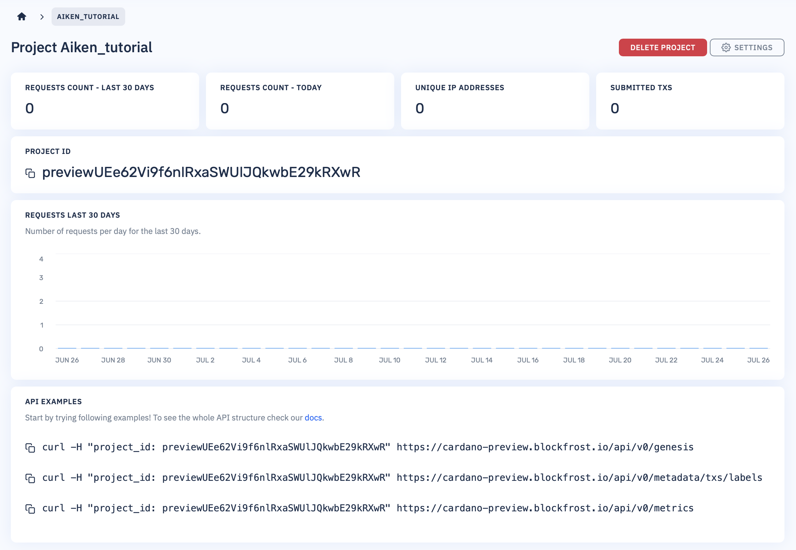
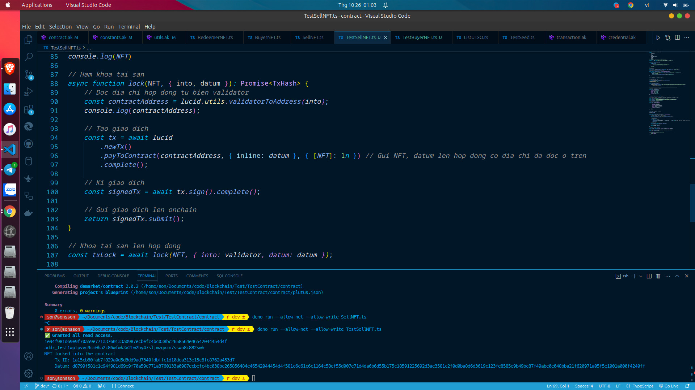
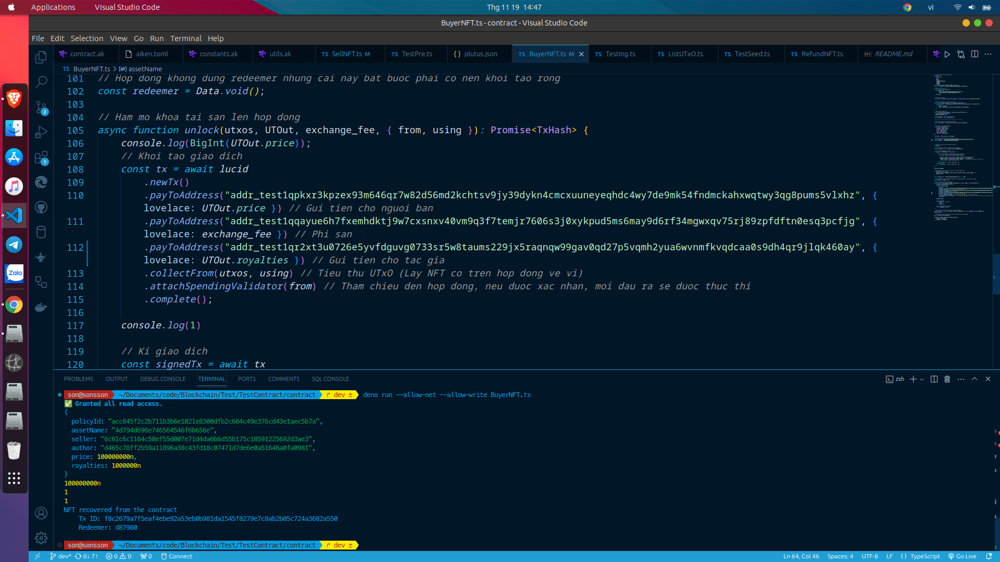
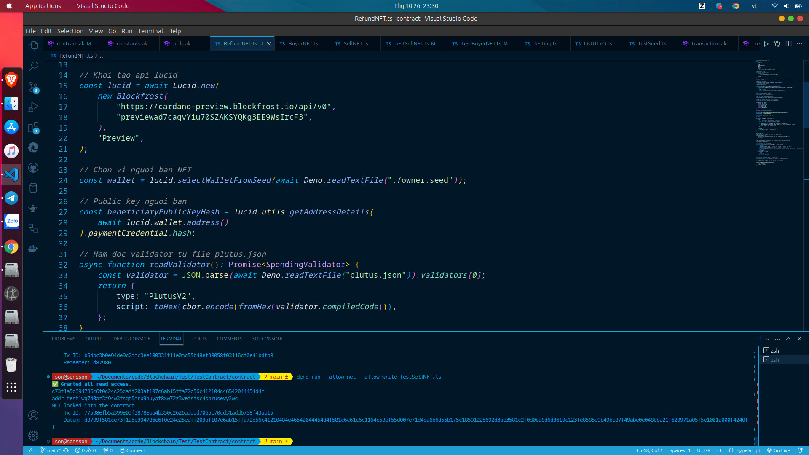

# Tương tác với hợp đồng thông minh sàn giao dịch NFT

Qua bài học hôm trước, các bạn đã được viết hoàn chỉnh một hợp đồng thông minh về sàn giao dịch NFT, đến với bài học hôm nay, mình sẽ hướng dẫn các bạn cách để tương tác với hợp đồng thông minh này. 

Nội dung chính của bài học hôm nay như sau:

* Thực hiện giao dịch bán
* Thực hiện giao dịch mua
* Thực hiện giao dịch refund

Ở bài giảng hôm trước, mình có giới thiệu cho các bạn về mô hình và cấu trúc của bài toán này, nếu các bạn chưa xem có thể quay về bài học hôm trước và xem qua những kiến thức trước khi bước vào bài học ngày hôm nay. Chúng ta cùng bắt đầu bài học nhé các bạn:

## Chuẩn bị

Ở bài học hôm nay, mình sẽ sử dụng typescript, Deno và API Lucid để viết tương tác, vì vậy, các bạn hãy chuẩn bị giúp mình một số thứ như sau:  

### Cài đặt deno

MacOS:

```sh
curl -fsSL https://deno.land/install.sh | sh
```

Windows:

```sh
irm https://deno.land/install.ps1 | iex
```

Linux:

```sh
curl -fsSL https://deno.land/install.sh | sh
```

### Tạo API Blockfrost

Các bạn hãy truy cập trang [blockfrost.io](https://blockfrost.io/dashboard) và hãy tạo giúp mình API key. Trong bài học này, mình sẽ hướng dẫn các bạn lập trình chạy thử chain ở mạng _**Preview**_ nên mình sẽ tạo một API trên mạng _**Preview**_.



## Thực hiện giao dịch bán

Đây là một loại giao dịch cho phép người bán đẩy tài sản lên smart contract của sàn giao dịch mà chúng ta đã viết ở hôm trước. Chúng ta sẽ thực hiện đẩy tài sản và dữ liệu đính kèm cùng một tập lệnh xác thực lên một địa chỉ của smart contract, hay tập lệnh đó chính là validator mà các bạn đã viết trong bài học hôm trước.

Đầu tiên, các bạn hãy khởi tạo giúp mình file có tên _**seller.ts**_

### Khai báo thư viện

Ở trong gói **lucid**, ta cần khai báo một số gói con cần dùng và các gói **cbor**.

```typescript
// import modules from libraries
import {
    Blockfrost,
    C,
    Data,
    Lucid,
    SpendingValidator,
    TxHash,
    fromHex,
    toHex,
    Wallet,
} from "https://deno.land/x/lucid@0.8.4/mod.ts";
import * as cbor from "https://deno.land/x/cbor@v1.4.1/index.js";
```

### Khởi tạo các tham số

Có một số các tham số chúng ta cần khởi tạo, ở lucid, các bạn sẽ truyền API key blockfrost và lựa chọn mạng đúng để có thể tạo giao dịch.

Ở phần ví, các bạn có thể select từ seedphrase đã tạo từ các ví nami, eternl, ... Sẽ thuận tiện hơn cho các bạn rất nhiều trong quá trình di chuyển tài sản để test, nó sẽ tường minh và rõ ràng hơn.

Trong phần validator, các bạn sẽ select và mã hoá từ file _**plutus.json**_, lấy ra file bytecode của hợp đồng và mã hoá thành dạng cbor để khi tạo giao dịch có thể đính kèm vào đầu ra của giao dịch bán.

```typescript
// Create the lucid api
const lucid = await Lucid.new(
    new Blockfrost(
        "https://cardano-preview.blockfrost.io/api/v0",
        "previewUEe62Vi9f6nlRxaSWUlJQkwbE29kRXwR",
    ),
    "Preview",
);

// Select wallet
const wallet = lucid.selectWalletFromSeed(await Deno.readTextFile("./owner.seed"));

// Function to read validator from plutus.json file
async function readValidator(): Promise<SpendingValidator> {
    const validator = JSON.parse(await Deno.readTextFile("plutus.json")).validators[0];
    return {
        type: "PlutusV2",
        script: toHex(cbor.encode(fromHex(validator.compiledCode))),
    };
}

// Read the validator and assign it to a variable
const validator = await readValidator();
```

### Tạo tham số public key hash

Ta có 2 tham số cần khởi tạo, chính là public key hash của owner và author, hay đó chính là verification key hash. Tham số nhận vào là một địa chỉ, mình sẽ chọn author là một địa chỉ ví bất kỳ.

```typescript
// Public key of the seller
const ownerPublicKeyHash = lucid.utils.getAddressDetails(
    await lucid.wallet.address()
).paymentCredential.hash;

// Public key of the NFT creator
const authorPublicKeyHash =
    lucid.utils.getAddressDetails("addr_test1qpkxr3kpzex93m646qr7w82d56md2kchtsv9jy39dykn4cmcxuuneyeqhdc4wy7de9mk54fndmckahxwqtwy3qg8pums5vlxhz")
        .paymentCredential.hash;
```

### Khởi tạo cấu trúc của kiểu dữ liệu datum

Cấu trúc của datum phải giống như cấu trúc datum mà các bạn đã viết trên hợp đồng, cấu trúc này bao gồm các trường:

* policyId có dạng String
* assetName có dạng String
* seller có dạng String
* author có dạng String
* price có dạng BigInt
* royalties có dạng BigInt

Ý nghĩa của các trường mình đã giải thích đến các bạn ở bài học hôm trước, nếu bạn nào quên, hãy xem lại ở bài hôm trước nhé!

```typescript
// initialize the Datum object
const Datum = Data.Object({
    policyId: Data.String,
    assetName: Data.String,
    seller: Data.String,
    author: Data.String,
    price: Data.BigInt,
    royalties: Data.BigInt,
});

type Datum = Data.Static<typeof Datum>;
```

### Gán giá trị cho các trường dữ liệu có trong datum

Mình sẽ mô phỏng một giao dịch của một NFT có giá 100ADA và tổng chi phí (Bao gồm phí sàn và phí bản quyền cho tác giả). Sau khi khởi tạo xong các tham số, mình sẽ khởi tạo biến datum với kiểu dữ liệu mình đã khởi tạo phía trên.

Các bạn hãy tự tạo cho mình một NFT và lưu ý ví bán các bạn phải có NFT đó. Các bạn có thể tạo trên [demarket.vn](https://demarket.vn/mint).

```typescript
// The data needed for the datum field (Public key of the seller and author above)
const Price = 100000000n;
const royalties = BigInt(parseInt(Price) * 1 / 100);
const policyId = "f6d61e2b83e15ce8ca7645e21ea4e552cad719d36290d07b50477100";
const assetName = "44656d61726b6574";
const fee = royalties + BigInt(parseInt(Price) * 1 / 100);

// Pass data into datum
const datum = Data.to<Datum>(
    {
        policyId: policyId,
        assetName: assetName,
        seller: ownerPublicKeyHash,
        author: authorPublicKeyHash,
        price: Price,
        royalties: royalties,
    },
    Datum
);
```

### NFT

Đơn giản, khi bạn muốn đẩy một loại tài sản nào đó lên hợp đồng chỉ cần truyền lên một policyID + assetName của tài sản đó.

```typescript
// NFTs are for sale
const NFT = policyId + assetName;
console.log(NFT)
```

### Function lock tài sản lên hợp đồng

Function này sẽ nhận vào một NFT là một chuỗi gồm policyID và assetName mà mình đã tạp phía trên, nhận vào khoản phí (Phí sàn và phí bản quyền), into ở đây chính là validator và datum đã khởi tạo phía trên.

Trong function, địa chỉ smart contract được lấy ra từ validator. Sau đó sẽ tạo một giao dịch đẩy NFT và phí bán lên hợp đồng (Với tư tưởng là người bán sẽ phải thanh toán khoản phí sàn và phí bản quyền cho tác giả). Sau khi tạo giao dịch xong, chúng ta sẽ ký và submit nó lên onchain, và function sẽ trả về cho chúng ta một mã có tên là txHash, đó là định danh đại diện cho một giao dịch.

```typescript
// Asset locking function
async function lock(NFT, fee, { into, datum }): Promise<TxHash> {
    // Read the contract address from the validator variable
    const contractAddress = lucid.utils.validatorToAddress(into);
    console.log(contractAddress);

    // Create transaction
    const tx = await lucid
        .newTx()
        .payToContract(contractAddress, { inline: datum }, { [NFT]: 1n, lovelace: fee }) // Submit NFT and exchange + royalty fees to the contract
        .complete();

    // Sign transaction
    const signedTx = await tx.sign().complete();

    // Send transactions to onchain
    return signedTx.submit();
}
```

### Chờ kết quả giao dịch

Chúng ta sẽ thực hiện gọi đến function lock đã viết trước đó và sẽ chờ cho đến khi giao dịch thực hiện thành công thì chúng ta sẽ in nó ra

```typescript
// Lock assets into contracts
const txLock = await lock(NFT, fee, { into: validator, datum: datum });

// Time until the transaction is confirmed on the Blockchain
await lucid.awaitTx(txLock);

console.log(`NFT locked into the contract
    Tx ID: ${txLock}
    Datum: ${datum}
`);
```

### Kết quả



### Code đầy đủ

```typescript
// import modules from libraries
import {
    Blockfrost,
    C,
    Data,
    Lucid,
    SpendingValidator,
    TxHash,
    fromHex,
    toHex,
    Wallet,
} from "https://deno.land/x/lucid@0.8.4/mod.ts";
import * as cbor from "https://deno.land/x/cbor@v1.4.1/index.js";

// Create the lucid api
const lucid = await Lucid.new(
    new Blockfrost(
        "https://cardano-preview.blockfrost.io/api/v0",
        "previewad7caqvYiu70SZAKSYQKg3EE9WsIrcF3",
    ),
    "Preview",
);

// Select wallet
const wallet = lucid.selectWalletFromSeed(await Deno.readTextFile("./owner.seed"));

// Function to read validator from plutus.json file
async function readValidator(): Promise<SpendingValidator> {
    const validator = JSON.parse(await Deno.readTextFile("plutus.json")).validators[0];
    return {
        type: "PlutusV2",
        script: toHex(cbor.encode(fromHex(validator.compiledCode))),
    };
}

// Read the validator and assign it to a variable
const validator = await readValidator();

// Public key of the seller
const ownerPublicKeyHash = lucid.utils.getAddressDetails(
    await lucid.wallet.address()
).paymentCredential.hash;

// Public key of the NFT creator
const authorPublicKeyHash =
    lucid.utils.getAddressDetails("addr_test1qpkxr3kpzex93m646qr7w82d56md2kchtsv9jy39dykn4cmcxuuneyeqhdc4wy7de9mk54fndmckahxwqtwy3qg8pums5vlxhz")
        .paymentCredential.hash;


// --------------------------------------------------------------------------

// initialize the Datum object
const Datum = Data.Object({
    policyId: Data.String,
    assetName: Data.String,
    seller: Data.String,
    author: Data.String,
    price: Data.BigInt,
    royalties: Data.BigInt,
});

type Datum = Data.Static<typeof Datum>;

// The data needed for the datum field (Public key of the seller and author above)
const Price = 100000000n;
const royalties = BigInt(parseInt(Price) * 1 / 100);
const policyId = "f6d61e2b83e15ce8ca7645e21ea4e552cad719d36290d07b50477100";
const assetName = "44656d61726b6574";
const fee = royalties + BigInt(parseInt(Price) * 1 / 100);

// Pass data into datum
const datum = Data.to<Datum>(
    {
        policyId: policyId,
        assetName: assetName,
        seller: ownerPublicKeyHash,
        author: authorPublicKeyHash,
        price: Price,
        royalties: royalties,
    },
    Datum
);

// NFTs are for sale
const NFT = policyId + assetName;
console.log(NFT)

// Asset locking function
async function lock(NFT, fee, { into, datum }): Promise<TxHash> {
    // Read the contract address from the validator variable
    const contractAddress = lucid.utils.validatorToAddress(into);
    console.log(contractAddress);

    // Create transaction
    const tx = await lucid
        .newTx()
        .payToContract(contractAddress, { inline: datum }, { [NFT]: 1n, lovelace: fee }) // Submit NFT and exchange + royalty fees to the contract
        .complete();

    // Sign transaction
    const signedTx = await tx.sign().complete();

    // Send transactions to onchain
    return signedTx.submit();
}

// Lock assets into contracts
const txLock = await lock(NFT, fee, { into: validator, datum: datum });

// Time until the transaction is confirmed on the Blockchain
await lucid.awaitTx(txLock);

console.log(`NFT locked into the contract
    Tx ID: ${txLock}
    Datum: ${datum}
`);
```

### Code thực hiện bán nhiều NFT trong một giao dịch

```typescript
// import modules from libraries
import {
    Blockfrost,
    C,
    Data,
    Lucid,
    SpendingValidator,
    TxHash,
    fromHex,
    toHex,
    Wallet,
} from "https://deno.land/x/lucid@0.8.4/mod.ts";
import * as cbor from "https://deno.land/x/cbor@v1.4.1/index.js";

// Create the lucid api
const lucid = await Lucid.new(
    new Blockfrost(
        "https://cardano-preview.blockfrost.io/api/v0",
        "previewad7caqvYiu70SZAKSYQKg3EE9WsIrcF3",
    ),
    "Preview",
);

// Select wallet
const wallet = lucid.selectWalletFromSeed(await Deno.readTextFile("./owner.seed"));

// Function to read validator from plutus.json file
async function readValidator(): Promise<SpendingValidator> {
    const validator = JSON.parse(await Deno.readTextFile("plutus.json")).validators[0];
    return {
        type: "PlutusV2",
        script: toHex(cbor.encode(fromHex(validator.compiledCode))),
    };
}

// Read the validator and assign it to a variable
const validator = await readValidator();

// Public key of the seller
const ownerPublicKeyHash = lucid.utils.getAddressDetails(
    await lucid.wallet.address()
).paymentCredential.hash;

// Public key of the NFT creator
const authorPublicKeyHash =
    lucid.utils.getAddressDetails("addr_test1qpkxr3kpzex93m646qr7w82d56md2kchtsv9jy39dykn4cmcxuuneyeqhdc4wy7de9mk54fndmckahxwqtwy3qg8pums5vlxhz")
        .paymentCredential.hash;


// --------------------------------------------------------------------------

// initialize the Datum object
const Datum = Data.Object({
    policyId: Data.String,
    assetName: Data.String,
    seller: Data.String,
    author: Data.String,
    price: Data.BigInt,
    royalties: Data.BigInt,
});

type Datum = Data.Static<typeof Datum>;

// The data needed for the datum field (Public key of the seller and author above)
const Price = 100000000n;
const royalties = BigInt(parseInt(Price) * 1 / 100);
const policyId1 = "c5dfd5c92cf454d9d1ee40d9ab3e9208dc21197d88ce51fe3160e01f";
const assetName1 = "4d794d696e746564546f6b656e";
const policyId2 = "d8db13a077b4fd63b5560e9cea7e39f0b11a67eeb89f5e3df9a45d0a";
const assetName2 = "4e46542044454d4f";
const policyId = [policyId1, policyId2];
const assetName = [assetName1, assetName2];
const NFT = [policyId1 + assetName1, policyId2 + assetName2];
const fee = royalties + BigInt(parseInt(Price) * 1 / 100);

let datum = []


for (let i = 0; i < NFT.length; i++) {
    // Pass data into datum
    let tmp = Data.to<Datum>(
        {
            policyId: policyId[i],
            assetName: assetName[i],
            seller: ownerPublicKeyHash,
            author: authorPublicKeyHash,
            price: Price,
            royalties: royalties,
        },
        Datum
    );
    datum.push(tmp);
}


// Asset locking function
async function lock(NFT, fee, { into, datum }): Promise<TxHash> {
    // Read the contract address from the validator variable
    const contractAddress = lucid.utils.validatorToAddress(into);
    console.log(contractAddress);

    // Create transaction
    let tx = await lucid
        .newTx();

    for (let i = 0; i < datum.length; i++) {
        tx = await tx.payToContract(contractAddress, { inline: datum[i] }, { [NFT[i]]: 1n, lovelace: fee });
    }

    tx = await tx
        .complete();

    // Sign transaction
    const signedTx = await tx.sign().complete();

    // Send transactions to onchain
    return signedTx.submit();
}

// Lock assets into contracts
const txLock = await lock(NFT, fee, { into: validator, datum: datum });

// Time until the transaction is confirmed on the Blockchain
await lucid.awaitTx(txLock);

console.log(`NFT locked into the contract
    Tx ID: ${txLock}
    Datum: ${datum}
`);
```

## Thực hiện giao dịch mua

Đây là giao dịch tiêu thụ một UTxO có trên hợp đồng thông minh mua bán NFT mà các bạn đã viết trước đó, có nghĩa rằng đây là giao dịch mua NFT từ trên hợp đồng thông minh. Để mở khoá được UTxO chứa các tài sản đó, các bạn phải đáp ứng đủ các tiêu chí và điều kiện đã có trên hợp đồng như giá và địa chỉ gửi.

### Khai báo thư viện

Ở trong gói **lucid**, ta cần khai báo một số gói con cần thiết và các gói **cbor** được sử dụng trong giao dịch mua.

```typescript
// Import modules from libraries
import {
    Blockfrost,
    C,
    Data,
    Lucid,
    SpendingValidator,
    TxHash,
    fromHex,
    toHex,
} from "https://deno.land/x/lucid@0.8.4/mod.ts";
import * as cbor from "https://deno.land/x/cbor@v1.4.1/index.js";
```

### Khởi tạo các tham số

Có một số các tham số chúng ta cần khởi tạo, ở lucid, các bạn sẽ truyền API key blockfrost và lựa chọn mạng đúng để có thể tạo giao dịch.

Ở phần ví, các bạn có thể select từ seedphrase đã tạo từ các ví nami, eternl, ... Sẽ thuận tiện hơn cho các bạn rất nhiều trong quá trình di chuyển tài sản để test, nó sẽ tường minh và rõ ràng hơn.

Trong phần validator, các bạn sẽ select và mã hoá từ file _**plutus.json**_, nó sẽ giúp các bạn lấy ra các UTxO và mở khoá chúng trên hợp đồng mà các bạn đã viết.

```typescript
// Initialize the lucid API
const lucid = await Lucid.new(
    new Blockfrost(
        "https://cardano-preview.blockfrost.io/api/v0",
        "previewad7caqvYiu70SZAKSYQKg3EE9WsIrcF3",
    ),
    "Preview",
);

// Select buyer wallet
const wallet = lucid.selectWalletFromSeed(await Deno.readTextFile("./beneficiary.seed"));

// Function to read validator from plutus.json file
async function readValidator(): Promise<SpendingValidator> {
    const validator = JSON.parse(await Deno.readTextFile("plutus.json")).validators[0];
    return {
        type: "PlutusV2",
        script: toHex(cbor.encode(fromHex(validator.compiledCode))),
    };
}

// Read the validator and assign it to a variable
const validator = await readValidator();
```

### Đọc địa chỉ hợp đồng từ validator

Chúng ta sẽ đọc địa chỉ smart contract từ validator chúng ta đã biên dịch ra, đây chính là địa chỉ của hợp đồng mà các bạn đã viết ở bài học hôm trước.

```typescript
// Read the contract address from the validator variable
const scriptAddress = lucid.utils.validatorToAddress(validator);
```

### Đọc UTxO từ địa chỉ của hợp đồng

Sử dụng đoạn lệnh này, các bạn có thể đọc ra tất cả các UTxO có trên hợp đồng của các bạn.

```typescript
// Retrieve all UTxOs present on the contract address
const scriptUtxos = await lucid.utxosAt(scriptAddress);
```

### Khởi tạo định danh của NFT cần mua

Chắc hẳn các bạn cũng đã biết, đại diện cho 1 NFT gồm policyID + assetName, ở đây, mình cũng sẽ chọn ra 1 NFT muốn mua và lấy policyID + assetName của NFT đó.

```typescript
// NFT data to filter out UTxOs containing that NFT
const policyId = "f6d61e2b83e15ce8ca7645e21ea4e552cad719d36290d07b50477100";
const assetName = "44656d61726b6574";
```

### Lọc và tìm các UTxO chứa các NFT cần mua

Mình sẽ thực hiện lọc các UTxO với policyID và assetName của NFT mình muốn mua đó. Mình sẽ lọc trong các UTxO mà mình đã lấy ra ở trên hợp đồng.

Đồng thời ở đây mình cũng tạo thêm một biến UTOut, mục đích của biến này để lấy ra datum của UTxO đã được lọc.

```typescript
// Get the UTxO datum containing the NFT you want to buy
let UTOut;

// Retrieve all UTxOs present on the contract address
const scriptUtxos = await lucid.utxosAt(scriptAddress);

// Filter out UTxOs containing NFTs to purchase
const utxos = scriptUtxos.filter((utxo) => {
    try {
        // Pour datum data into the temp variable of the current UTxO
        const temp = Data.from<Datum>(utxo.datum, Datum);

        // Check to see if that UTxO actually contains the NFT you want to buy?
        if (temp.policyId === policyId && temp.assetName === assetName) {
            UTOut = Data.from<Datum>(utxo.datum, Datum); // Get the data of UTxO and pour it into a variable
            return true; // That UTxO has been taken
        }
        return false; // That UTxO is not selected
    } catch (e) {
        return false; // That UTxO is not selected
    }
});

console.log(UTOut)
```

### Khởi tạo cấu trúc của Datum

Cũng giống như ở trên, datum này cũng sẽ phải giống như cấu trúc của datum có trên hợp đồng.

```typescript
// Initialize Datum object
const Datum = Data.Object({
    policyId: Data.String,
    assetName: Data.String,
    seller: Data.String,
    author: Data.String,
    price: Data.BigInt,
    royalties: Data.BigInt,
});

type Datum = Data.Static<typeof Datum>;
```

### Tính toán phí và khởi tạo redeemer

Ở đây, mình sẽ lấy ra số tiền của tài sản đó và tính phí sàn 1% cho giá của NFT đó.


```typescript
// Exchange fees need to be paid
const exchange_fee = BigInt(parseInt(UTOut.price) * 1 / 100);
```

Mình sẽ khởi tạo datum với kiểu dữ liệu là **Data.void()**, vì ở hợp đồng này mình không dùng gì đến redeemer cả.

```typescript
// The contract does not use a redeemer, but this is required so it is initialized empty
const redeemer = Data.void();
```

### Hàm mở khoá tài sản

Function này có chức năng mở khoá tài sản trên hợp đồng, hàm sẽ khởi tạo một giao dịch với các luồng UTxO được chuyển cho người bán, người mua và sàn giao dịch với số tiền tương ứng có trong datum và collect UTxO từ trên hợp đồng thông minh của mình, và giao dịch ở đây sẽ là giao dịch tiêu thụ (Spending).

Sau khi thực hiện giao dịch, lúc này ta sẽ ký và submit lên onchain của mạng lưới Cardano. Lúc này, function sẽ trả về cho chúng ta một txHash, là định danh của giao dịch tiêu thụ đó.

```typescript
// The function unlocks the assets on the contract
async function unlock(utxos, UTOut, exchange_fee, { from, using }): Promise<TxHash> {
    console.log(BigInt(UTOut.price));
    // Initiate transaction
    const tx = await lucid
        .newTx()
        .payToAddress("addr_test1qpkxr3kpzex93m646qr7w82d56md2kchtsv9jy39dykn4cmcxuuneyeqhdc4wy7de9mk54fndmckahxwqtwy3qg8pums5vlxhz", { lovelace: UTOut.price }) // Send money to the seller
        .payToAddress("addr_test1qqayue6h7fxemhdktj9w7cxsnxv40vm9q3f7temjr7606s3j0xykpud5ms6may9d6rf34mgwxqv75rj89zpfdftn0esq3pcfjg", { lovelace: exchange_fee }) // trading platform fees
        .payToAddress("addr_test1qpkxr3kpzex93m646qr7w82d56md2kchtsv9jy39dykn4cmcxuuneyeqhdc4wy7de9mk54fndmckahxwqtwy3qg8pums5vlxhz", { lovelace: UTOut.royalties }) // Send money to buyer
        .collectFrom(utxos, using) // Consume UTxO (Get NFTs on the contract to the wallet)
        .attachSpendingValidator(from) // Refers to the contract, if confirmed, all outputs will be implemented
        .complete();

    console.log(1)

    // Sign the transaction
    const signedTx = await tx
        .sign()
        .complete();

    // Send transactions to onchain
    return signedTx.submit();
}
```

### Chờ kết quả giao dịch

Chúng ta sẽ thực hiện gọi đến function unlock đã viết trước đó và sẽ chờ cho đến khi giao dịch thực hiện thành công thì chúng ta sẽ in nó ra.

```typescript
// Execute the asset purchase transaction in the contract
const txUnlock = await unlock(utxos, UTOut, exchange_fee, { from: validator, using: redeemer });
console.log(1);

// Waiting time until the transaction is confirmed on the Blockchain
await lucid.awaitTx(txUnlock);

console.log(`NFT recovered from the contract
    Tx ID: ${txUnlock}
    Redeemer: ${redeemer}
`);
```

### Kết quả

Đây là kết quả sau khi thực hiện giao dịch mua:



### Code đầy đủ

```typescript
// Import modules from libraries
import {
    Blockfrost,
    C,
    Data,
    Lucid,
    SpendingValidator,
    TxHash,
    fromHex,
    toHex,
} from "https://deno.land/x/lucid@0.8.4/mod.ts";
import * as cbor from "https://deno.land/x/cbor@v1.4.1/index.js";

// Initialize the lucid API
const lucid = await Lucid.new(
    new Blockfrost(
        "https://cardano-preview.blockfrost.io/api/v0",
        "previewad7caqvYiu70SZAKSYQKg3EE9WsIrcF3",
    ),
    "Preview",
);

// Select buyer wallet
const wallet = lucid.selectWalletFromSeed(await Deno.readTextFile("./beneficiary.seed"));


// Function to read validator from plutus.json file
async function readValidator(): Promise<SpendingValidator> {
    const validator = JSON.parse(await Deno.readTextFile("plutus.json")).validators[0];
    return {
        type: "PlutusV2",
        script: toHex(cbor.encode(fromHex(validator.compiledCode))),
    };
}

// Public key for the buyer
const beneficiaryPublicKeyHash = lucid.utils.getAddressDetails(
    await lucid.wallet.address()
).paymentCredential.hash;

// Read the validator and assign it to a variable
const validator = await readValidator();

// ---------------------------------------------------

// Read the contract address from the validator variable
const scriptAddress = lucid.utils.validatorToAddress(validator);


// Initialize Datum object
const Datum = Data.Object({
    policyId: Data.String,
    assetName: Data.String,
    seller: Data.String,
    author: Data.String,
    price: Data.BigInt,
    royalties: Data.BigInt,
});

type Datum = Data.Static<typeof Datum>;

// NFT data to filter out UTxOs containing that NFT
const policyId = "f6d61e2b83e15ce8ca7645e21ea4e552cad719d36290d07b50477100";
const assetName = "44656d61726b6574";

// Get the UTxO datum containing the NFT you want to buy
let UTOut;

// Retrieve all UTxOs present on the contract address
const scriptUtxos = await lucid.utxosAt(scriptAddress);

// Filter out UTxOs containing NFTs to purchase
const utxos = scriptUtxos.filter((utxo) => {
    try {
        // Pour datum data into the temp variable of the current UTxO
        const temp = Data.from<Datum>(utxo.datum, Datum);

        // Check to see if that UTxO actually contains the NFT you want to buy?
        if (temp.policyId === policyId && temp.assetName === assetName) {
            UTOut = Data.from<Datum>(utxo.datum, Datum); // Get the data of UTxO and pour it into a variable
            return true; // That UTxO has been taken
        }
        return false; // That UTxO is not selected
    } catch (e) {
        return false; // That UTxO is not selected
    }
});

console.log(UTOut)

// If no UTxO is selected, the program will stop
if (utxos.length === 0) {
    console.log("No redeemable utxo found. You need to wait a little longer...");
    Deno.exit(1);
}

// Exchange fees need to be paid
const exchange_fee = BigInt(parseInt(UTOut.price) * 1 / 100);

// The contract does not use a redeemer, but this is required so it is initialized empty
const redeemer = Data.void();

// The function unlocks the assets on the contract
async function unlock(utxos, UTOut, exchange_fee, { from, using }): Promise<TxHash> {
    console.log(BigInt(UTOut.price));
    // Initiate transaction
    const tx = await lucid
        .newTx()
        .payToAddress("addr_test1qpkxr3kpzex93m646qr7w82d56md2kchtsv9jy39dykn4cmcxuuneyeqhdc4wy7de9mk54fndmckahxwqtwy3qg8pums5vlxhz", { lovelace: UTOut.price }) // Send money to the seller
        .payToAddress("addr_test1qqayue6h7fxemhdktj9w7cxsnxv40vm9q3f7temjr7606s3j0xykpud5ms6may9d6rf34mgwxqv75rj89zpfdftn0esq3pcfjg", { lovelace: exchange_fee }) // trading platform fees
        .payToAddress("addr_test1qpkxr3kpzex93m646qr7w82d56md2kchtsv9jy39dykn4cmcxuuneyeqhdc4wy7de9mk54fndmckahxwqtwy3qg8pums5vlxhz", { lovelace: UTOut.royalties }) // Send money to buyer
        .collectFrom(utxos, using) // Consume UTxO (Get NFTs on the contract to the wallet)
        .attachSpendingValidator(from) // Refers to the contract, if confirmed, all outputs will be implemented
        .complete();

    console.log(1)

    // Sign the transaction
    const signedTx = await tx
        .sign()
        .complete();

    // Send transactions to onchain
    return signedTx.submit();
}

// Execute the asset purchase transaction in the contract
const txUnlock = await unlock(utxos, UTOut, exchange_fee, { from: validator, using: redeemer });
console.log(1);

// Waiting time until the transaction is confirmed on the Blockchain
await lucid.awaitTx(txUnlock);

console.log(`NFT recovered from the contract
    Tx ID: ${txUnlock}
    Redeemer: ${redeemer}
`);
```

### Code thực hiện mua nhiều NFT

```typescript
// Import modules from libraries
import {
    Blockfrost,
    C,
    Data,
    Lucid,
    SpendingValidator,
    TxHash,
    fromHex,
    toHex,
} from "https://deno.land/x/lucid@0.8.4/mod.ts";
import * as cbor from "https://deno.land/x/cbor@v1.4.1/index.js";

// Initialize the lucid API
const lucid = await Lucid.new(
    new Blockfrost(
        "https://cardano-preview.blockfrost.io/api/v0",
        "previewad7caqvYiu70SZAKSYQKg3EE9WsIrcF3",
    ),
    "Preview",
);

// Select buyer wallet
const wallet = lucid.selectWalletFromSeed(await Deno.readTextFile("./beneficiary.seed"));


// Function to read validator from plutus.json file
async function readValidator(): Promise<SpendingValidator> {
    const validator = JSON.parse(await Deno.readTextFile("plutus.json")).validators[0];
    return {
        type: "PlutusV2",
        script: toHex(cbor.encode(fromHex(validator.compiledCode))),
    };
}

// Public key for the buyer
const beneficiaryPublicKeyHash = lucid.utils.getAddressDetails(
    await lucid.wallet.address()
).paymentCredential.hash;

// Read the validator and assign it to a variable
const validator = await readValidator();

// ---------------------------------------------------

// Read the contract address from the validator variable
const scriptAddress = lucid.utils.validatorToAddress(validator);


// Initialize Datum object
const Datum = Data.Object({
    policyId: Data.String,
    assetName: Data.String,
    seller: Data.String,
    author: Data.String,
    price: Data.BigInt,
    royalties: Data.BigInt,
});

type Datum = Data.Static<typeof Datum>;

// NFT data to filter out UTxOs containing that NFT
const policyId1 = "e73f1a5e394786e6f0e24e25eaff203af107e6ab15ffa72e56c41210";
const assetName1 = "4e46542044454d4f";
const policyId2 = "d65f2d926936dd92e7f5a57645c86472774b24c2dcf15cdeefd509d9";
const assetName2 = "6e677579656e206b68616e68";
const policyId = [policyId1, policyId2];
const assetName = [assetName1, assetName2];


// Get the UTxO datum containing the NFT you want to buy

// Retrieve all UTxOs present on the contract address
const scriptUtxos = await lucid.utxosAt(scriptAddress);

let utxos = []

for (let i = 0; i < policyId.length; i++) {
    for (let u = 0; u < scriptUtxos.length; u++) {
        try {
            // Pour datum data into the temp variable of the current UTxO
            const temp = Data.from<Datum>(scriptUtxos[u].datum, Datum);

            // Check to see if that UTxO actually contains the NFT you want to buy?
            if (temp.policyId === policyId[i] && temp.assetName === assetName[i]) {
                utxos.push(scriptUtxos[u])
            }
        } catch (e) {
        }
    }
}

console.log(utxos)


// If no UTxO is selected, the program will stop
if (utxos.length === 0) {
    console.log("No redeemable utxo found. You need to wait a little longer...");
    Deno.exit(1);
}

let UTOut = []

for (let i = 0; i < utxos.length; i++) {
    UTOut.push(Data.from<Datum>(utxos[i].datum, Datum));
}
console.log(UTOut)

// The contract does not use a redeemer, but this is required so it is initialized empty
const redeemer = Data.void();

// The function unlocks the assets on the contract
async function unlock(utxos, UTOut, { from, using }): Promise<TxHash> {
    console.log(utxos);
    console.log(UTOut);

    // Initiate transaction
    let tx = await lucid
        .newTx();

    for (let i = 0; i < utxos.length; i++) {
        // Exchange fees need to be paid
        let exchange_fee = BigInt(parseInt(UTOut[i].price) * 1 / 100);
        tx = await tx
            .payToAddress("addr_test1qpkxr3kpzex93m646qr7w82d56md2kchtsv9jy39dykn4cmcxuuneyeqhdc4wy7de9mk54fndmckahxwqtwy3qg8pums5vlxhz", { lovelace: UTOut[i].price })
            .payToAddress("addr_test1qqayue6h7fxemhdktj9w7cxsnxv40vm9q3f7temjr7606s3j0xykpud5ms6may9d6rf34mgwxqv75rj89zpfdftn0esq3pcfjg", { lovelace: exchange_fee })
            .payToAddress("addr_test1qpkxr3kpzex93m646qr7w82d56md2kchtsv9jy39dykn4cmcxuuneyeqhdc4wy7de9mk54fndmckahxwqtwy3qg8pums5vlxhz", { lovelace: UTOut[i].royalties }); // Send money to buyer
    }
    tx = await tx
        .collectFrom(utxos, using)
        .attachSpendingValidator(from)
        .complete();

    console.log(1);

    // Sign the transaction
    let signedTx = await tx.sign().complete();

    // Send transactions to onchain
    return signedTx.submit();
}

// Execute the asset purchase transaction in the contract
const txUnlock = await unlock(utxos, UTOut, { from: validator, using: redeemer });
console.log(1);

// Waiting time until the transaction is confirmed on the Blockchain
await lucid.awaitTx(txUnlock);

console.log(`NFT recovered from the contract
    Tx ID: ${txUnlock}
    Redeemer: ${redeemer}
`);
```

## Thực hiện giao dịch refund

Giao dịch này sẽ trả về cho người bán NFT nếu họ không muốn bán nữa, chỉ cần chữ ký của người bán trong ScriptContext trùng khớp với chữ ký của người bán có trong datum.

Code cũng khá là giống với code trong phần buy NFT, khác một cái là ở phần giao dịch, không cần gửi tiền đến địa chỉ nào, chỉ cần thêm chữ ký xác thực của người bán, giao dịch sẽ được chấp thuận

```typescript
// import modules from libraries
import {
    Blockfrost,
    C,
    Data,
    Lucid,
    SpendingValidator,
    TxHash,
    fromHex,
    toHex,
} from "https://deno.land/x/lucid@0.8.3/mod.ts";
import * as cbor from "https://deno.land/x/cbor@v1.4.1/index.js";

// Create the lucid api
const lucid = await Lucid.new(
    new Blockfrost(
        "https://cardano-preview.blockfrost.io/api/v0",
        "previewad7caqvYiu70SZAKSYQKg3EE9WsIrcF3",
    ),
    "Preview",
);

// Sellect wallet of seller NFT
const wallet = lucid.selectWalletFromSeed(await Deno.readTextFile("./owner.seed"));

// Public key of the seller
const beneficiaryPublicKeyHash = lucid.utils.getAddressDetails(
    await lucid.wallet.address()
).paymentCredential.hash;

// Function to read validator from plutus.json file
async function readValidator(): Promise<SpendingValidator> {
    const validator = JSON.parse(await Deno.readTextFile("plutus.json")).validators[0];
    return {
        type: "PlutusV2",
        script: toHex(cbor.encode(fromHex(validator.compiledCode))),
    };
}

// Read the validator and assign it to a variable
const validator = await readValidator();

// ---------------------------------------------------
// Read the contract address from the validator variable
const scriptAddress = lucid.utils.validatorToAddress(validator);

// we get all the UTXOs sitting at the script address
const scriptUtxos = await lucid.utxosAt(scriptAddress);

// Initialize Datum object
const Datum = Data.Object({
    policyId: Data.String,
    assetName: Data.String,
    seller: Data.String,
    author: Data.String,
    price: Data.BigInt,
    royalties: Data.BigInt,
});

type Datum = Data.Static<typeof Datum>;

// NFT data to filter out UTxO containing the NFT to be retrieved
const policyId = "d8db13a077b4fd63b5560e9cea7e39f0b11a67eeb89f5e3df9a45d0a";
const assetName = "4e46542044454d4f";

// Get the UTxO datum containing the NFT you want to buy
let UTOut;

// Filter out UTxOs containing NFTs to purchase
const utxos = scriptUtxos.filter((utxo) => {
    try {
        // Pour datum data into the temp variable of the current UTxO
        const temp = Data.from<Datum>(utxo.datum, Datum);

        // Check to see if UTxO is currently available as an NFT that can be purchased? Check to see if the UTxO actually contains the NFT you want to buy
        if (temp.policyId === policyId && temp.assetName === assetName) {
            UTOut = Data.from<Datum>(utxo.datum, Datum); // get the datum of that UTxO into a variable
            return true; // UTxO is getted
        }

        return false; // That UTxO is not selected 
    } catch (e) {
        return false; // That UTxO is not selected
    }
});

console.log(UTOut)

// If no UTxO is selected, the program will be used
if (utxos.length === 0) {
    console.log("No redeemable utxo found. You need to wait a little longer...");
    Deno.exit(1);
}


// The contract does not use a redeemer, but this is required so it is initialized empty
const redeemer = Data.empty();

// function unlocks assets onto the contract
async function unlock(utxos, { from, using }): Promise<TxHash> {
    const tx = await lucid // Initialize transaction
        .newTx()
        .collectFrom(utxos, using) // Consume UTxO (retrieve NFTs on the contract to the wallet)
        .addSigner(await lucid.wallet.address()) // Add a signature from the seller
        .attachSpendingValidator(from) // Refers to the contract, if confirmed all output will be executed
        .complete();

    // Sign transaction
    const signedTx = await tx
        .sign()
        .complete();
    // Send transaction to onchain
    return signedTx.submit();
}

// Execution of taking back the sold property in the contract
const txUnlock = await unlock(utxos, { from: validator, using: redeemer });

// Time until the transaction is confirmed on the blockchain
await lucid.awaitTx(txUnlock);

console.log(`NFT recovered from the contract
    Tx ID: ${txUnlock}
    Redeemer: ${redeemer}
`);
```

### Kết quả



## Kết luận

Bài học hôm nay mình đã hướng dẫn cho các bạn cách tương tác với hợp đồng thông minh mà bài học hôm trước các bạn đã được viết, bài này cũng tương đối là dài, các bạn hãy chịu khó đọc và tìm hiểu thêm để hiểu sâu sắc hơn về hệ sinh thái Cardano.

Ở video tiếp theo, cũng là video cuối cùng, mình sẽ hướng dẫn cho các bạn cách tương tác với hợp đồng thông minh bằng giao diện front-end. Xin chào và hẹn gặp lại các bạn trong video tiếp theo, tạm biệt các bạn.